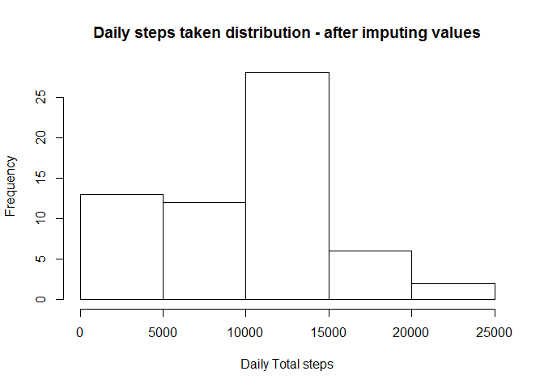

## Introduction

It is now possible to collect a large amount of data about personal movement using activity monitoring devices such as a Fitbit, Nike Fuelband, or Jawbone Up. These type of devices are part of the "quantified self" movement - a group of enthusiasts who take measurements about themselves regularly to improve their health, to find patterns in their behavior, or because they are tech geeks. But these data remain under-utilized both because the raw data are hard to obtain and there is a lack of statistical methods and software for processing and interpreting the data.

This assignment makes use of data from a personal activity monitoring device. This device collects data at 5 minute intervals through out the day. The data consists of two months of data from an anonymous individual collected during the months of October and November, 2012 and include the number of steps taken in 5 minute intervals each day.

The data for this assignment was obtained from:[Source](https://d396qusza40orc.cloudfront.net/repdata%2Fdata%2Factivity.zip)

The variables included in this dataset are:

    steps: Number of steps taking in a 5-minute interval (missing values are coded as NA\color{red}{\verb|NA|}NA)
    date: The date on which the measurement was taken in YYYY-MM-DD format
    interval: Identifier for the 5-minute interval in which measurement was taken

The dataset is stored in a comma-separated-value (CSV) file and there are a total of 17,568 observations in this dataset.

##Task 

The task of this assignment is to generate a report in markdown formate which describes the dataset mentioned above.

##Loading and Processing Data

```r
##Read data
activity<-read.csv("activity.csv")
##Transform date into Date format
activity$date<-as.Date(activity$date,"%Y-%m-%d")
##Mean steps
Mean_steps<-mean(activity$steps,na.rm = TRUE)
##Activity dataset summary
summary(activity)
```

```
##      steps             date               interval     
##  Min.   :  0.00   Min.   :2012-10-01   Min.   :   0.0  
##  1st Qu.:  0.00   1st Qu.:2012-10-16   1st Qu.: 588.8  
##  Median :  0.00   Median :2012-10-31   Median :1177.5  
##  Mean   : 37.38   Mean   :2012-10-31   Mean   :1177.5  
##  3rd Qu.: 12.00   3rd Qu.:2012-11-15   3rd Qu.:1766.2  
##  Max.   :806.00   Max.   :2012-11-30   Max.   :2355.0  
##  NA's   :2304
```

## Part 1
###What is mean total number of steps taken per day? 37 steps on average per day

Compute total number of steps taken per day, showing only the first 20


```r
##Daily Total steps
Daily<-activity%>%group_by(day(date),month(date),year(date))%>%summarise(Sum=sum(na.omit(steps)),Mean=mean(steps,na.rm = T),Median=median(steps,na.rm = T))
##Clean the Names 
Names<-c("Day","Month","Year","Sum","Mean","Median")
names(Daily)<-make.names(Names)
##Change months number to names
Daily$Month<-month.abb[Daily$Month]
print.data.frame(head(Daily,20))
```

```
##    Day Month Year   Sum     Mean Median
## 1    1   Oct 2012     0      NaN     NA
## 2    1   Nov 2012     0      NaN     NA
## 3    2   Oct 2012   126  0.43750      0
## 4    2   Nov 2012 10600 36.80556      0
## 5    3   Oct 2012 11352 39.41667      0
## 6    3   Nov 2012 10571 36.70486      0
## 7    4   Oct 2012 12116 42.06944      0
## 8    4   Nov 2012     0      NaN     NA
## 9    5   Oct 2012 13294 46.15972      0
## 10   5   Nov 2012 10439 36.24653      0
## 11   6   Oct 2012 15420 53.54167      0
## 12   6   Nov 2012  8334 28.93750      0
## 13   7   Oct 2012 11015 38.24653      0
## 14   7   Nov 2012 12883 44.73264      0
## 15   8   Oct 2012     0      NaN     NA
## 16   8   Nov 2012  3219 11.17708      0
## 17   9   Oct 2012 12811 44.48264      0
## 18   9   Nov 2012     0      NaN     NA
## 19  10   Oct 2012  9900 34.37500      0
## 20  10   Nov 2012     0      NaN     NA
```

The above table shows that the data come from two months, thats October and November, it also shows each day's total from those months a well as the mean and median.

##Plot total steps

```r
hist(Daily$Sum,xlab = "Daily Total steps" ,main="Daily steps taken distribution")
```

<!-- -->

##Plot for each month

```r
##Separate by Month
Oct<-filter(Daily,Month=="Oct")
Nov<-filter(Daily,Month=="Nov")
par(2:1)
```

```
## NULL
```

```r
hist(Oct$Sum,xlab = "Daily Total steps" ,main="Daily steps taken distribution  - October")
```

<!-- -->

```r
hist(Nov$Sum,xlab = "Daily Total steps" ,main="Daily steps taken distribution - November")
```

<!-- -->

 Q3.  Calculate and report the mean and median of the total number of steps taken per day?


```r
mean_daily<-mean(Daily$Sum,na.rm = T)
median_daily<-median(Daily$Sum,na.rm = T)
mean_median<-data.frame(Mean=mean_daily,Media=median_daily)
print.data.frame(mean_median)
```

```
##      Mean Media
## 1 9354.23 10395
```
Table Showing the mean and median 

##What is the average daily activity pattern?

Q1. Make a time series plot (i.e. type = "l") of the 5-minute interval (x-axis) and the average number of steps taken, averaged across all days (y-axis)


```r
Interval<-activity%>%group_by(interval)%>%summarise(Average=mean(na.omit(steps)))
##Plot
plot(x=Interval$interval,y=Interval$Average,type = "l",xlab = "5 minute interval",ylab ="Interval average",main = "Times series plot for the steps taken in 5 min interval")
```

<!-- -->

Q.2 Which 5-minute interval, on average across all the days in the dataset, contains the maximum number of steps?


```r
Interval[which.max(as.numeric(unlist(Interval$Average))),]
```

```
## # A tibble: 1 x 2
##   interval Average
##      <int>   <dbl>
## 1      835    206.
```
Therefore Interval 835 contains the maximum number of steps

##Imputing missing values
Note that there are a number of days/intervals where there are missing values (coded as NA). The presence of missing days may introduce bias into some calculations or summaries of the data.

Q1. Calculate and report the total number of missing values in the dataset (i.e. the total number of rows NAs)


```r
##sum missing values
colSums(is.na(activity))
```

```
##    steps     date interval 
##     2304        0        0
```

Q2. Devise a strategy for filling in all of the missing values in the dataset. The strategy does not need to be sophisticated. For example, you could use the mean/median for that day, or the mean for that 5-minute interval, etc

will plot the data to see the distribution of since we know its only the steps variable that has some missing values


```r
hist(na.omit(activity$steps),xlab = "Steps",main = "distribution of steps taken everyday")
```

<!-- -->
 
 The data is skewed i.e a positive skew, will therefore use median to impute missing values
 

```r
#The data is skewed, will use median to inpute missing values
na_index<-is.na(activity$steps)
new_activity<-activity
##Replace NAs
new_activity$steps[na_index]<-median(new_activity$steps,na.rm = T)
```
Q3. Create a new dataset that is equal to the original dataset but with the missing data filled in.

- Created in the above code chunk called new_activity

```r
summary(new_activity)
```

```
##      steps             date               interval     
##  Min.   :  0.00   Min.   :2012-10-01   Min.   :   0.0  
##  1st Qu.:  0.00   1st Qu.:2012-10-16   1st Qu.: 588.8  
##  Median :  0.00   Median :2012-10-31   Median :1177.5  
##  Mean   : 32.48   Mean   :2012-10-31   Mean   :1177.5  
##  3rd Qu.:  0.00   3rd Qu.:2012-11-15   3rd Qu.:1766.2  
##  Max.   :806.00   Max.   :2012-11-30   Max.   :2355.0
```
 - all the missing values have been taken care of using median
 
Q4. Make a histogram of the total number of steps taken each day and Calculate and report the mean and median total number of steps taken per day. Do these values differ from the estimates from the first part of the assignment? What is the impact of imputing missing data on the estimates of the total daily number of steps?

##Plot total steps - after imputing values

```r
##DailyTotal
new_Daily<-new_activity%>%group_by(day(date),month(date),year(date))%>%summarise(Sum=sum(steps),Mean=mean(steps),Median=median(steps))
#Change variable names
names(new_Daily)<-make.names(Names)
##Change months number to names
new_Daily$Month<-month.abb[new_Daily$Month]
##Plot total steps
hist(new_Daily$Sum,xlab = "Daily Total steps" ,main="Daily steps taken distribution - after imputing values")
```

<!-- -->


```r
new_Oct<-filter(new_Daily,Month=="Oct")
new_Nov<-filter(new_Daily,Month=="Nov")
par(1:2)
```

```
## NULL
```

```r
hist(new_Oct$Sum,main="Distribution after imputing NAs",xlab="steps")
```

<!-- -->

```r
hist(new_Nov$Sum,main="Distribution after imputing NAs",xlab="steps")
```

<!-- -->

##Are there differences in activity patterns between weekdays and weekends?

For this part the weekdays() function may be of some help here. Use the dataset with the filled-in missing values for this part.

Q1.Create a new factor variable in the dataset with two levels - "weekday" and "weekend" indicating whether a given date is a weekday or weekend day.


```r
##Inset into a new dataset whether a day is a weekend or weekday
new_activity$Day<-ifelse(weekdays(new_activity$date,T)=="Sat"|weekdays(new_activity$date,T)=="Sun","Weekend","Weekday")
##Convert Day name to factor
new_activity$Day<-as.factor(new_activity$Day)
str(new_activity)
```

```
## 'data.frame':	17568 obs. of  4 variables:
##  $ steps   : num  0 0 0 0 0 0 0 0 0 0 ...
##  $ date    : Date, format: "2012-10-01" "2012-10-01" ...
##  $ interval: int  0 5 10 15 20 25 30 35 40 45 ...
##  $ Day     : Factor w/ 2 levels "Weekday","Weekend": 1 1 1 1 1 1 1 1 1 1 ...
```

Q2. Make a panel plot containing a time series plot (i.e. type = "l") of the 5-minute interval (x-axis) and the average number of steps taken, averaged across all weekday days or weekend days (y-axis). See the README file in the GitHub repository to see an example of what this plot should look like using simulated data.


```r
##Get averages by Day type
Day_type_mean<-new_activity%>%group_by(Day,interval)%>%summarise(Mean=mean(steps))
weekday<-filter(Day_type_mean,Day=="Weekday")
weekend<-filter(Day_type_mean,Day=="Weekend")
plot1<-ggplot(weekday,aes(interval,Mean))+geom_point(col="red")+geom_line(col="red")+ggtitle("Weekday")
plot2<-ggplot(weekend,aes(interval,Mean))+geom_point(col="blue")+geom_line(col="blue")+ggtitle("Weekend")

grid.arrange(plot1,plot2,nrow=2)
```

<!-- -->
